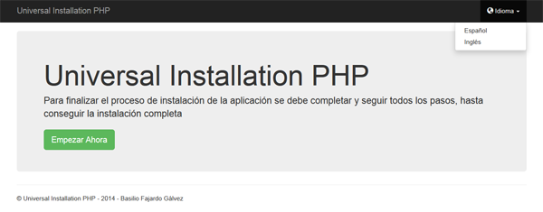
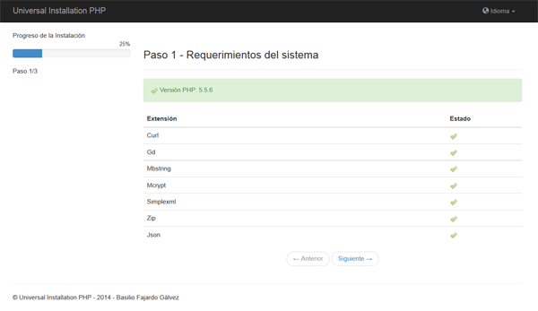
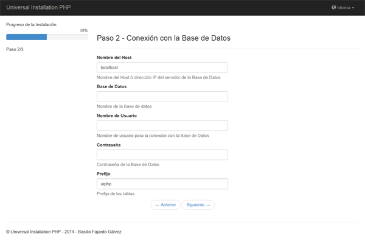
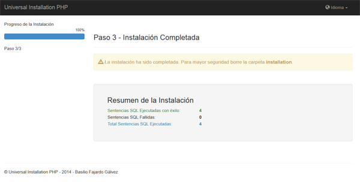

Universal-Installation-PHP
==========================

Universal Installation PHP is the ultimate tool to install PHP scripts in languages ​​Multiple blocks, a secilla and elegant.

Installation
------------

Unzip the file, leaving the installation directory included in your project. 
To run indicate the url in your browser: http://localhost/my_proyect/installation

Features
--------

<ol>
<li>Very easy to use and configure</li>
<li>Design based on Bootstrap 3</li>
<li>Multiple languages</li>
<li>Installation Overview</li>
<li>Creating log file with error trapping</li>
</ol>

How to use
----------

Puede personalizar su script de instalación editando el archivo <b>setting.xml</b>
<code>
&lt;?xml version="1.0" encoding="UTF-8"?&gt;
&lt;install&gt;
    &lt;title&gt;Universal Installation PHP&lt;/title&gt;
    &lt;copyright&gt;Universal Installation PHP - 2014 - Basilio Fajardo Gálvez&lt;/copyright&gt;
    &lt;source&gt;data.sql&lt;/source&gt;
    &lt;requires&gt;
        &lt;version&gt;5.1.2&lt;/version&gt;
        &lt;extension name="curl" /&gt;
        &lt;extension name="gd" /&gt;
        &lt;extension name="mbstring" /&gt;
        &lt;extension name="mcrypt" /&gt;
        &lt;extension name="simplexml" /&gt;
        &lt;extension name="zip" /&gt;
        &lt;extension name="json" /&gt;
    &lt;/requires&gt;
    &lt;languages&gt;
        &lt;default&gt;es&lt;/default&gt;
        &lt;language id="es"&gt;
            &lt;choose title="Idioma"&gt;
                &lt;option value="es"&gt;Español&lt;/option&gt;
                &lt;option value="en"&gt;Inglés&lt;/option&gt;
            &lt;/choose&gt;
        &lt;/language&gt;
        &lt;language id="en"&gt;
            &lt;choose title="Language"&gt;
                &lt;option value="es"&gt;Spanish&lt;/option&gt;
                &lt;option value="en"&gt;English&lt;/option&gt;
            &lt;/choose&gt;
        &lt;/language&gt;
    &lt;/languages&gt;
    &lt;values&gt;
        &lt;host&gt;localhost&lt;/host&gt;
        &lt;database&gt;&lt;/database&gt;
        &lt;username&gt;&lt;/username&gt;
        &lt;prefix&gt;uiphp&lt;/prefix&gt;
    &lt;/values&gt;
&lt;/install&gt;
</code>

